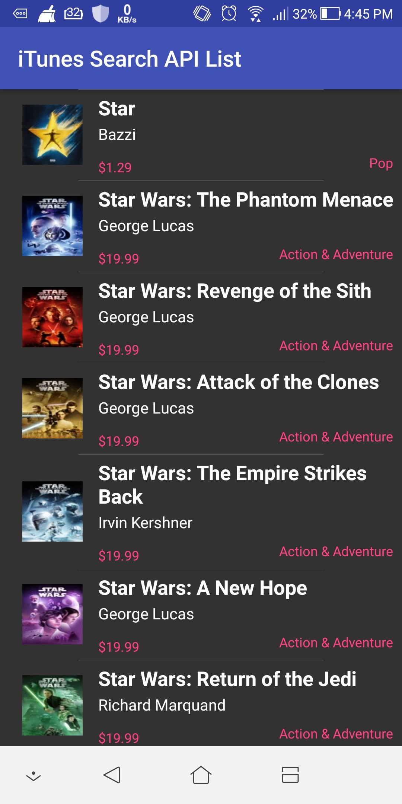

# droidTunes

Fetches data from iTunes Search API 

## Features

With the app, you can:

* Display the list from https://itunes.apple.com/search?term=star&amp;country=au&amp;media=movie&amp;all 
* Display the Song Image, Track Name, Artist Name, Track Genre and Track Price when in list view.
* Display the Song Image, Track Name, Artist Name, Track Genre and Track Price, Release Daate and Long Description when in list details view.Get details about the track
* Inform user the last date he/she visited the application.
* Inform user if there is No Internet Connection.

## Built with

* [Butter Knife](http://jakewharton.github.io/butterknife/) - For binding views
* [Picasso](http://square.github.io/picasso/) - For image loading and caching
* [Retrofit](http://square.github.io/retrofit/) - For network calls

## Screenshots - Phone

## License

This project is licensed under the Apache License - see the [LICENSE.md](LICENSE.md) file for details
